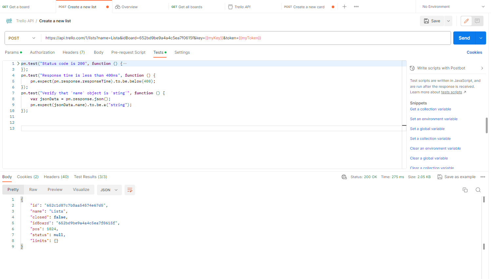
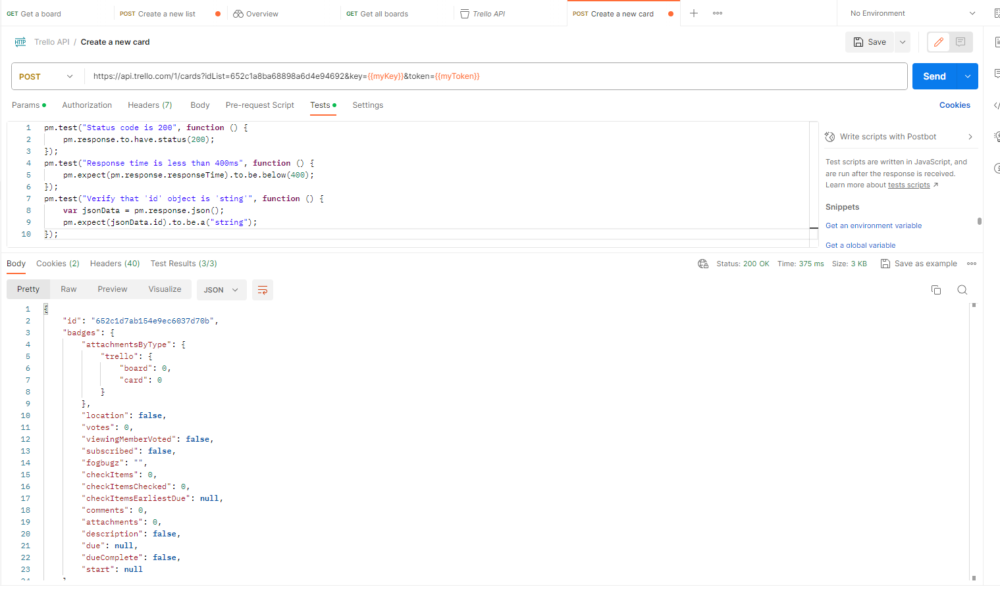
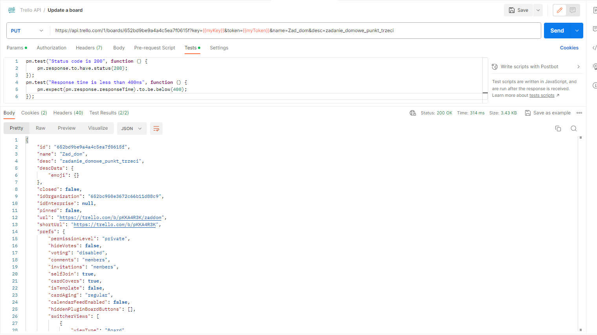

<h3>ZADANIE/TASK:</h3>

Utwórz kolejne żądania poprzez Postman:

1.Utwórz kolumnę na tablicy 

Dodaj testy:

<ul>
  <li>Na sprawdzenie statusu kodu</li>
  <li>na sprawdzenie czasu żądania</li>
  <li>na sprawdzenie, czy wartosć "name" to tekstowy typ danych</li>
</ul>
 

2.Utwórz po jednej karcie w kolumnie, dodaj testy: 

<ul>
  <li>Na sprawdzenie statusu kodu</li>
  <li>na sprawdzenie czasu żądania</li>
  <li>na sprawdzenie, czy wartosć "id" to tekstowy typ danych</li>
</ul>
 

3.Zaktualizuj informacje o utworzonej tablicy. Zmień nazwę tablicy i dodaj opis tablicy. dodaj testy:

<ul>
  <li>Na sprawdzenie statusu kodu</li>
  <li>na sprawdzenie czasu żądania</li>
</ul>
 
<h3>TRANSLATION:</h3>

Create further requests through Postman

1.Create a column on the board 

Add tests:

<ul>
  <li>To check the status of the code</li>
  <li>to check the request time</li>
  <li>To check if the value "name" is a text data type</li>
</ul>
 

2.Create one card per column, add tests: 

<ul>
 <li>To check the status of the code</li>
  <li>to check the request time</li>
  <li>To check if the value "id" is a text data type</li>
</ul>
 

3.Update the information on the created board. Rename the board and add a board description. add tests:

<ul>
  <li>To check the status of the code</li>
  <li>to check the request time</li>
</ul>
 
<h3>ZADANIE 1/ TASK 1</h3>

 
<h3>ZADANIE 2/ TASK 2</h3>

<h3>ZADANIE 3/ TASK 3</h3>

 

